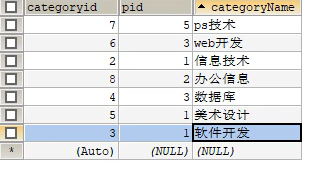
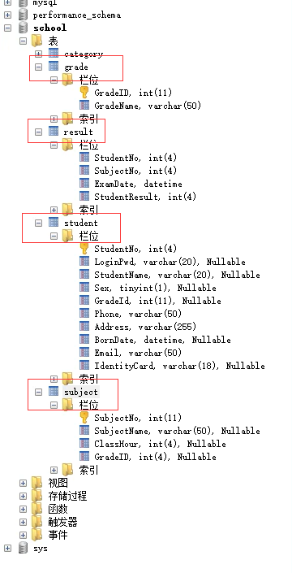

## 一、DML
### 一、数据插入--insert into
- 1、字段一一对应
```aidl   
INSERT INTO student(`id`,`name`) VALUES ('3','lpvh');

-- 在已有的表中插入字段
ALTER TABLE student ADD `scores` INT(100) DEFAULT 0;

-- 插入一个student
INSERT INTO student(`id`,`name`,`scores`) VALUES('4','JILI','100');

INSERT INTO `student`(`scores`)  VALUES('99') WHERE id = 1;


-- 字段一一对应
INSERT INTO `student`(`id`,`scores`) VALUES ('7','92');

-- 插入多个student，使用逗号分割
INSERT INTO `student`(`id`,`name`,`scores`) VALUES('5','po','97'),('6','ppo','96');
```


### 二、修改数据--update  table set----
- 1、修改单个或者多个属性  
    - update--set--   //改变表的具体数据
    - alter table 表名   //改变表的结构
```aidl
//1、 修改某个表字段的值，使用关键字update和set，使用where删选条件
UPDATE `student` SET `scores`='100' WHERE id = 1;

//2、不指定条件的情况下，字段scores都会修改为100
UPDATE `student` SET `scores`='100'

//3、修改了多个属性
UPDATE `student` SET `name`='jj',`scores`= '120' WHERE id = 1;

//4、datetime(整数)
ALTER TABLE student ADD `time` datetime(6) DEFAULT NULL;

//5、获取当前时间
UPDATE `student` SET `time`= CURRENT_TIME WHERE id = 1;

```
- 2、modify 和 change 的区别
```aidl
//6、修改某个字段的约束（就是什么类型的）--使用关键字modify
ALTER TABLE `student` MODIFY `time` datetime(5);
//7、change 修改的是字段名称----使用关键字change（必须要写字段类型）
ALTER TABLE `student` CHANGE `time` `timechange` datetime(1);
```

- 运算符（where删选条件--多属性）
    - =
    - ！= （<>）
    - between...and....(都是闭区间) 
    - or
    - and

### 3、删除----delete
- delete：```delete from 表名 where 条件```(不建议delete from 表名)
- truncate ：完全清空一个数据库表，表的结构和索引约束不会变 ``` truncate 表名```
    - 二者区别
        - delete不会影响自增，比如使用delete删除前三条数据，再次添加数据的时候会从id=4开始，这不是我们想要的
        - truncate会影响自增，清空为0，然后开始自增1，2，3；不会影响事务
    - 二者相同点
        - 都不会改变变表的结构，都能删除数据
## 二、DQL（查询数据）***
### （1）、查询
1、查询全部的学生:
``` select * from 表名 ```

2、查询指定的字段--筛选出只有指定字段的全部数据:
``` select '字段名1','字段名2' * from 表名```

3、给表和字段起别名:
``` select '字段名1' as '新名字1','字段名2' as '新名字2' * from 表名1  as '新表名';```

4、函数concat--做连接:
```select councat('列出字段起个名字，用于展示',字段1（注：这里不需要加tab上面的符号）） AS '新名字' from 表名;```


### （2）、数据去重--很多学生参加了很多考试，我们所要的结果只有一个就可以了
- distinct：去重关键字
- ``` select distinct '字段1' from '表名';```

### （3）、数据库的列（表达式）:
```select 表达式 from 表   //文本，列，函数、计算表达式、系统变量```
```aidl
//1、所有学生的考试成绩+1分
select 'studentname', 'studentgrades'+1 as '提分后成绩' from  '表名';

//2、科学计算
select 100-1+5 as '计算结果'; //计算表达式

//3、查询系统版本
select version(); //函数

//4、查询自增步长
select @@auto_increment_increment; //变量
```
## where 条件子句
1、检索数据中符合条件的值
- 逻辑运算符---尽量使用英文字符
  - and &&
  - or  ||
  - not  !、
- 示例：
```aidl
//查询考试成绩在95-100分之间
//1、使用between.....and.....
select studentid,studentGrades, from student where studentGrades between 95 and 100;
//2、使用>,<和and连接符来组合
select `studentid`,`studentGrades`, from student where studentGrades>95 and studentGrades <100;
//查询学号在100-200,400-500之间的---符合一个的都可以找出来，所以使用or
select `studentid` from student where studentid > 100 and studentid < 200 
or studentid>400 and studentid <500; 

//查询除了1000号学生之外的其余学生的成绩
select `studentid`,`studentGrades`, from student where `studentid`!= 1000;

select `studentid`,`studentGrades`, from student where not `studentid` = 1000;

```

2、模糊查询：比较运算符
- is null //如果操作运算符为null，结果为真
- is not null
- between
- like  //sql匹配，如果a匹配b，则结果为真
- in  //a in (a1,a2,a3),如果a在其中，那么结果为真
示例：
```aidl
//%: 代表0~任意一个字符   _: 代表一个字符
//1、查询名字带刘开头的学生  
select `studentName` from student where `studentName` like '刘%';
//2、查询名字带刘开头的学生，名字后面只有一个字的----_
select `studentName` from student where `studentName` like '刘_';
//3、查询名字中间有嘉字的同学--%
select `studentName` from student where `studentName` like '%嘉%';

//查询1001，1002，1003号学员--in
select `studentId`,`studentName` from student where `studentId` in (1001,1002,1003);

//查询在北京的学生
select `studentAddress`,`studentName` from student where `studentAddress` =('北京');

//null   not null(空)----查询为空的要用is null
//查询地址为空的学生
select `studentAddress`,`studentName` from student where `studentAddress` = '' or
`studentAddress` is null;


//查询有出生日期的同学
select `studentBirthdy`,`studentName` from student where `studentBirthdy` is not null;

//查询没有出生日期的同学
select `studentBirthdy`,`studentName` from student where `studentBirthdy` is null;

```
3、联表查询--无论哪种连接，都是2个表先合并
- inner join:如果表中至少有一个匹配，就返回行
- left join: 会从左表中返回所有的值，即使右表没有匹配，没有匹配的字段可以自动填充为null
- right join: 会从右表中返回所有的值，即使左表没有匹配，没有匹配的字段可以自动填充为null
示例：
```aidl
//查询缺考的同学
select s.studentNO,studentName,studentResult 
from student as s
left join results as r
on s.studentNO = r.studentNO
where studentResult is null;

```
- join（连接的表） on（判断的条件）: 连接查询
- join（连接的表）where（判断的条件）: 等值查询

    
分析思路：
- 1、分析需求，分析查询的字段来自哪些表（连接查询）
- 2、确定使用哪种连接查询？ 7种  确定交叉点（这2个表哪个数据是相同的） 判断条件：比如 s.studentNO = r.studentNO

### 自连接：查询父子信息：把一张表看为2个一模一样的表

总表：categroy



父类（顶级id，找pid为1的条目）:a

| categoryid | categoryName |
|------------|--------------|
| 2          | 信息技术         |
| 3          | 软件开发         |
| 5          | 美术设计         |

子表：b

| pid | categoryid | categoryid |
|----|------------|--------------|
| 5  | 7          | ps技术         |
| 3  | 6          | web开发        |
| 2  | 8          | 办公信息         |
| 3  | 4          | 数据库          |

```aidl
//1、查询字段来自哪些表
select  a.`categoryName` as '父栏目', b.`categoryName` as '子栏目'
from categroy as a,categroy as b
where a.`categoryid` = b.`pid`;

//查询参加了数据库-1考试同学信息：学号，学生姓名，科目名，分数
//有3个表学生表student，分数表results，科目表subject
select studentNO,studentName,subjectName,studentResult
from student  s
inner join results r
on s.studentNO = r.studentNO //找连接点，把这以上作为连接点，然后再inner join
inner join subject sub
on r.subjectNO = sub.subjectNO ////找连接点
where subjectName = "数据库-1";

  
```
### 关键字查询顺序

- select 
- 联合查询 
- where  
- group by（指定结果按照哪几个字段来分组） 
- having（过滤分组的记录必须满足的次要条件） 
- order by（指定查询记录按一个或多个条件排序）
- limit（指定查询记录从哪条到哪条）|
### select语句的执行顺序
SELECT语句中子句的执行顺序与SELECT语句中子句的输入顺序是不一样的，所以并不是从SELECT子句开始执行的，而是按照下面的顺序执行:
- 开始
- FROM子句-
- JOIN ON
- Where子句--特定过滤
- GROUP BY子句--分组
- HAVING子句--过滤分组的次要条件
- ORDER BY子句--排序
- SELECT子句--选择
- LIMIT子句--分页
- 最终结果```
### 分页(limit)跟排序(order by)
分页：总结第一个数字+1-->是表中第几个位置上的数据，后面一个数据是页面展示的记录数目

    limit 0，5  //第一个数据开始，页面展示5条数据
    limit 1，5  //从第二个数据开始，页面展示5条数据

数据库表：



```aidl
//查询所有数据库结构-1的所有考试结果（学号，科目编号，成绩），降序排序
select s.StudentNO,SubjectNO,StudentResult
from result r
inner join subject sub
on r.studentNO = sub.studentNO
where StudentName = '数据库结构-1'
order by StudentResult desc
//查询所有数据库结构-1的学生的学号（使用子查询--由里及外）

//分数不小于80分(在result表中)的学生的学号和姓名
select distinct,s.StudentNO,StudentName,
from student s
inner join result r
on s.StudentNO = r.StudentNO
where StudentResult >= 80

//查询课程为高等数学-2且分数不小于80分(在result表中)的学生的学号和姓名
//方式1：
select distinct,s.StudentNO,StudentName,     
from student s
inner join result r
on s.StudentNO = r.StudentNO
where StudentResult > 80 and
//这里面没有subjectName,通过subject这个表的SubjectNO和result表的studentNO联系起来
StudentNO = ( select SubjectNO from subject where subjectName = '高等数学-2' );

//方式2：
select distinct,s.StudentNO,StudentName,
from student s
inner join result r
on s.StudentNO = r.StudentNO
inner join subject sub
on r.SubjectName = sub.SubjectName
here subjectName = '高等数学-2' and StudentResult > 80;
       
```

### sql常用函数--select + 函数
- abs()  //取绝对值
- ceiling()  //向上取整
- floor() //向下取整
- rand() //随机函数，0-1之间
- sign() //标志函数
- char length() //字符串长度
- concat()  //拼接字符串
- insert() //插入，替换
- lower() //变小写
- upper() //变大写
- replace(srt1,str1中的某个字符，str被替换的新字符)
- substr(str,num1,num2) //str是从下标为1开始的，num1下标数，num2要截取的字符串长度
- reverse(str) //反转字符串